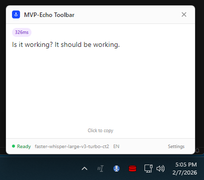

# MVP-Echo Toolbar

System tray voice-to-text for Windows 11. Press **Ctrl+Alt+Z** to record, press again to stop, hear a ding, paste with **Ctrl+V**. That's it.

No visible window during normal use. Lives in your notification area next to the microphone icon, works across all virtual desktops and monitors.



Click the blue tray icon to see your last transcription, copy it again, or adjust settings. Otherwise it stays out of your way.

## Requirements

1. **Faster-Whisper server** running on your LAN with a GPU. See [`faster-whisper-docker/`](faster-whisper-docker/) for the Docker setup.
2. **Windows 11** machine running the toolbar.

## Quick Start

1. Deploy the Whisper server on your LAN (e.g., Unraid):
   ```bash
   cd faster-whisper-docker
   scp -r . root@192.168.1.10:/mnt/user/appdata/faster-whisper-docker/
   ssh root@192.168.1.10 "cd /mnt/user/appdata/faster-whisper-docker && docker-compose up -d"
   ```

2. Run `MVP-Echo Toolbar 2.0.0.exe` on Windows (portable, no install needed).

3. The tray icon appears. Left-click to open the popup. Click **Settings** and set your server endpoint:
   ```
   http://192.168.1.10:20300/v1/audio/transcriptions
   ```

4. **Use it**:
   1. Hold down **Ctrl+Alt** and tap **Z** — recording starts (tray icon turns red)
   2. Speak naturally while still holding **Ctrl+Alt**
   3. Tap **Z** again — recording stops (icon turns yellow while processing)
   4. Wait for the **ding** — your transcription is automatically copied to clipboard
   5. **Ctrl+V** to paste anywhere

## Build From Source

```bash
cd mvp-echo-toolbar
npm install
npm run dist
```

Output: `dist/MVP-Echo Toolbar 2.0.0.exe` (portable) and `dist/MVP-Echo Toolbar Setup 2.0.0.exe` (installer).

## How It Works

```
Windows 11                           LAN Server (Unraid/Docker)
+-----------------------+            +--------------------------+
|  MVP-Echo Toolbar     |   HTTP     |  faster-whisper-server   |
|  (system tray app)    | ---------> |  (GPU transcription)     |
|                       |   audio    |                          |
|  Ctrl+Alt+Z = record  | <--------- |  NVIDIA GPU + CUDA       |
|  ding = clipboard     |   text     |  Port 20300              |
+-----------------------+            +--------------------------+
```

## Tray Icon States

| Color | Meaning |
|-------|---------|
| Blue | Ready |
| Red | Recording |
| Yellow | Processing |
| Green | Copied to clipboard |

## Project Structure

```
mvp-echo-toolbar/       # Electron app (React + Vite + TypeScript)
faster-whisper-docker/   # Server deployment (Docker Compose + nginx)
```
